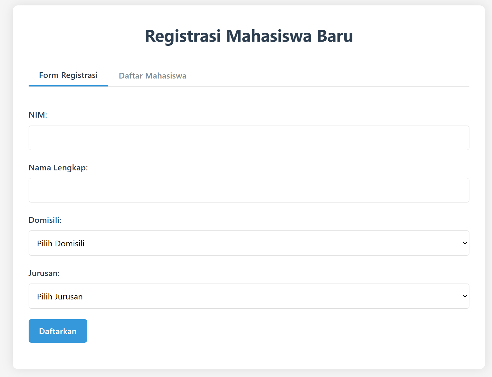
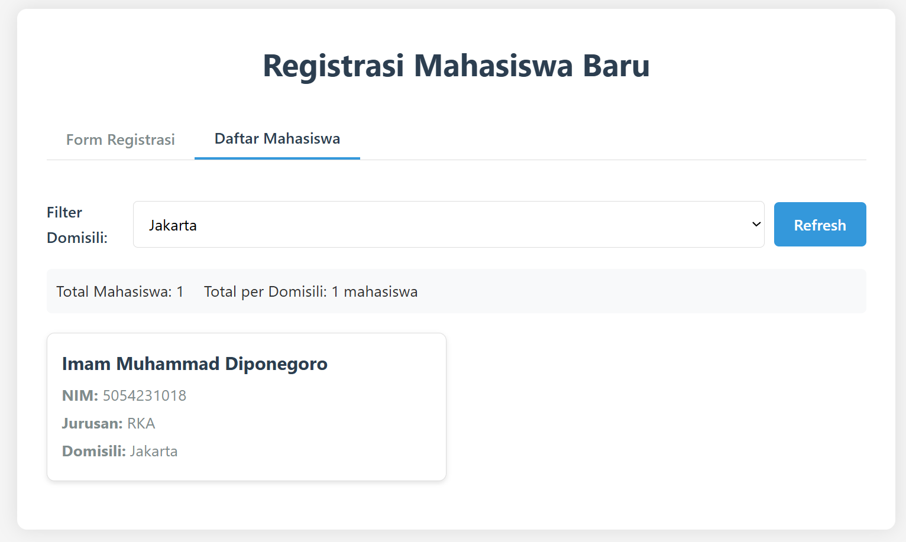

# Sistem Registrasi Mahasiswa 🎓

## 🌟 Fitur
- 📝 Form registrasi mahasiswa (AJAX)
- 📊 Tampilan data dengan filter domisili
- 🔌 API endpoint (`GET`/`POST`)
- 📱 Responsive design

## 📝 Form Registrasi Mahasiswa

1. Berdasarkan Teknologi
AJAX Form Submission
Form yang mengirim data tanpa reload halaman menggunakan fetch()/XMLHttpRequest

```
document.getElementById('formRegistrasi').addEventListener('submit', function(e) {
  e.preventDefault();
  fetch('api/mahasiswa.php', { 
    method: 'POST',
    body: JSON.stringify(formData) // 👈 Data diubah ke JSON
  });
});
```

3. Berdasarkan Validasi
Client-Side Validated Form
Validasi dilakukan di browser sebelum dikirim ke server:

```
if (!nim || !nama) { 
  showError("Harap isi semua field!");
  return; 
}
Server-Side Validated Form
```
Validasi tambahan di PHP:
```
if (empty($_POST['nim'])) {
  http_response_code(400);
  die(json_encode(["error" => "NIM wajib diisi"]));
}
```
## 📊 Data Grid Mahasiswa  
- Mengkonsumsi API `GET /mahasiswa.php`  
- Render data JSON ke dalam card HTML  
- Support filtering client-side  

```
function loadMahasiswa() {
  fetch('api/mahasiswa.php') // proses API Consumption
    .then(response => response.json()) // JSON Parsing
    .then(data => {
      // Dynamic Rendering-na
      data.data.forEach(mhs => {
        daftarMahasiswa.innerHTML += `
          <div class="mahasiswa-card">
            <h3>${mhs.nama}</h3>
            <p>NIM: ${mhs.nim}</p>
          </div>
        `;
      });
    });
}
```

## 🚀 Instalasi
1. Clone repo:
   ```bash
   git clone https://github.com/username/repo.git
```
2. Setup database: 
```
    CREATE TABLE mahasiswa (
        id INT AUTO_INCREMENT PRIMARY KEY,
        nim VARCHAR(20) NOT NULL UNIQUE,
        nama VARCHAR(100) NOT NULL,
        domisili VARCHAR(100) NOT NULL,
        jurusan VARCHAR(100) NOT NULL,
        tanggal_daftar TIMESTAMP DEFAULT CURRENT_TIMESTAMP
    );
```
3. Buat api/koneksi.php dari template:
```
    <?php
    $servername = "localhost";
    $username = "DB_USERNAME";
    $password = "DB_PASSWORD";
    $dbname = "mahasiswa_db";
    ?>
```
📂 Struktur File
```
api/
├── koneksi.example.php  
├── mahasiswa.php  
├── testAPI.php    
assets/
├── css/style.css     
├── js/script.js      
index.html            
```
🛠️ Penggunaan API
```
GET Data Mahasiswa

curl http://localhost/api/mahasiswa.php?domisili=Jakarta
// Response:
{
  "count": 5,
  "data": [
    {
      "nim": "20220001",
      "nama": "Budi Santoso",
      "domisili": "Jakarta",
      "jurusan": "Teknik Informatika"
    }
  ]
}
```